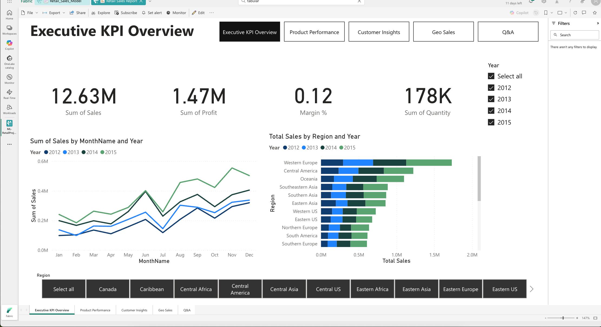

# Fabric Retail Analytics Project

**Author:** Marlon Lambert  
**Tech Stack:** Microsoft Fabric · Azure · Power BI · PySpark · Delta Lake · SQL Server

## Overview
This project demonstrates an end-to-end data engineering and analytics workflow in **Microsoft Fabric**, leveraging the **Medallion architecture** (Bronze → Silver → Gold) for data transformation and **Power BI DirectLake** for live reporting.

## Architecture
- **Bronze Layer:** Raw retail sales data (Excel/CSV) uploaded into Fabric Lakehouse.  
- **Silver Layer:** Cleansed and conformed tables using PySpark notebooks.  
- **Gold Layer:** Aggregated KPI tables for Power BI reporting.
- Little qwerk with pyspark, it did not allow me to create new schemas from the notebook. So used the Medallion naming convention on clean data but they all exist in the same schema.  
- **Visualization:** Power BI dashboard with DirectLake connection for real-time analytics.

## 📊 Dashboard
View the live Power BI dashboard here → [**View Dashboard**](https://app.fabric.microsoft.com/reportEmbed?reportId=3161d10f-5c99-4518-a5d3-8bb2a7ceb35d&autoAuth=true&ctid=8547dc42-5be6-4cd3-a863-a6be51afc13b)

## 🚀 Key Highlights
- Automated Fabric pipeline for daily refresh.  
- DAX measures for Sales, Profit, Margin %, YoY growth.  
- Role-based access and data validation with PySpark joins.  
- Demonstrates integration between Fabric Lakehouse and Power BI.

## 🧰 Files
| Folder | Description |
|--------|--------------|
| `data/` | Sample retail dataset |
| `notebooks/` | Fabric PySpark transformation scripts |
| `powerbi/` | Power BI report file (.pbix) |
| `screenshots/` | Dashboard preview images |

---

### 📫 Contact
**Marlon Lambert** – Sydney, NSW  
📧 marlonlambert@gmail.com  

